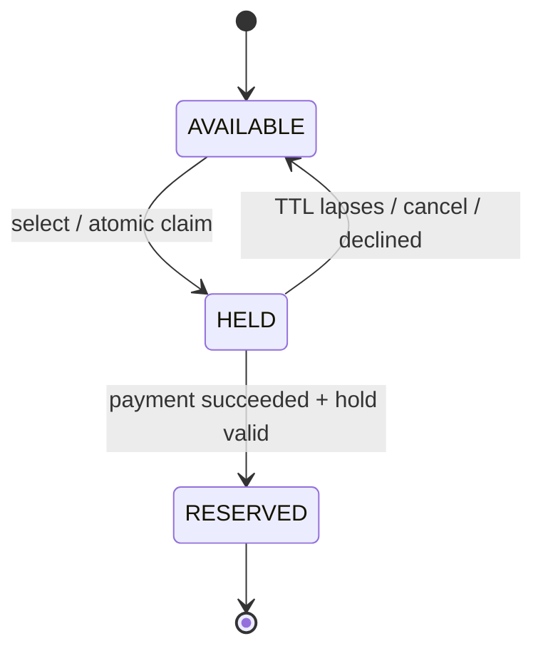

# Business Analysis Document — Public Seat Reservation Platform

| | |
|---|---|
| **Document** | Business Requirements & Analysis |
| **Version** | 1.0 |
| **Date** | 2026-06-16 |
| **Status** | For review |
| **Related** | [`Sequence-Diagrams.md`](./Sequence-Diagrams.md) · [`ASSESSMENT_ANALYSIS.md`](./ASSESSMENT_ANALYSIS.md) · `../src` (reference implementation) |

---

## 1. Purpose & audience

This document explains, in business terms, *what* the seat reservation platform must do and *why* —
independent of any framework or database. It is written for product owners, reviewers, QA, and
engineers, and is traceable down to the executable tests in `test/reservation.test.ts`.

## 2. Business context & problem statement

A venue operator wants to sell a **small, fixed inventory of seats** to the public online. Selling
limited inventory over the web has two failure modes that are unacceptable to the business:

1. **Selling the same seat twice (double-booking / oversell).** Two customers click "reserve" at the
   same moment; both must not end up owning seat A1.
2. **Money and inventory disagreeing.** A customer is charged but receives no seat, or receives a seat
   without paying. Either erodes trust and creates refund/chargeback and support cost.

The platform must let an authenticated customer **select a seat, pay, and have it reserved on payment
completion**, while guaranteeing the two failures above can never happen — including when customers
act concurrently, abandon checkout, or the payment provider retries notifications.

## 3. Goals & success metrics

| Goal | Success measure |
|---|---|
| Never oversell | 0 seats with more than one reservation |
| Money ⇄ inventory always consistent | 0 charges without a seat; 0 reservations without a settled payment |
| Inventory not locked by abandoned checkouts | Held-but-unpaid seats return to sale within the hold TTL |
| Trustworthy access | Only authenticated users reserve; sessions last 90 days |
| Operable & auditable | Every state change is reconstructable from stored payment/reservation records |

## 4. Stakeholders

| Stakeholder | Interest |
|---|---|
| **Customer** | Fair chance to buy; never charged without a seat |
| **Venue operator / business** | No oversell, no revenue leakage, low support load |
| **Finance** | Every charge reconciles to a reservation or a refund |
| **Engineering / Ops** | Predictable behaviour under concurrency and partial failure |
| **Payment provider** | Integration via intents + webhooks (retried, must be idempotent) |

## 5. Actors & systems

- **Customer** — the public buyer.
- **Authentication service** — issues and validates 90-day sessions.
- **Reservation service** — owns the seat lifecycle and the hold→pay→reserve workflow (the core).
- **Datastore** — durable seat/reservation/payment records with concurrency + uniqueness guarantees.
- **Payment gateway** — external; creates payment intents and notifies via signed webhooks.

## 6. Scope

**In scope:** authentication & sessions; viewing 3 seats; holding a seat; paying; reserving on
payment success; releasing abandoned holds; refunding un-honorable payments; idempotent webhook
handling; the business rules and edge cases below.

**Out of scope (with production path noted in [ASSESSMENT_ANALYSIS](./ASSESSMENT_ANALYSIS.md#5-trade-offs--deliberate-omissions)):**
real payment rails, real email/SMTP, multi-event/venue, seat maps beyond 3 seats, pricing/discounts,
admin tooling, horizontal-scale infrastructure, UI styling.

## 7. Glossary

| Term | Meaning |
|---|---|
| **Seat** | A unit of inventory. State is `AVAILABLE`, `HELD`, or `RESERVED`. |
| **Hold** | A temporary, exclusive claim on a seat for one user, with an expiry (TTL). |
| **TTL** | Time-to-live of a hold (e.g. 5 minutes) — the checkout window. |
| **Reservation** | The permanent record that a seat is sold to a user, created on payment success. |
| **Payment intent** | The gateway's representation of an attempted charge, keyed by an idempotency key. |
| **Idempotency key** | A stable identifier so a retried operation is applied at most once. |
| **Webhook** | An asynchronous, signed notification from the gateway about a payment's outcome. |
| **Compensation** | Undoing a side effect that can't be rolled back transactionally (here: a refund). |

## 8. Business rules

| ID | Rule |
|---|---|
| **BR-1** | A seat may be reserved by **at most one** user. No double-booking, ever. |
| **BR-2** | Only **authenticated** users may hold or reserve a seat. |
| **BR-3** | Selecting a seat places a **temporary, exclusive hold** for a fixed TTL; only the holder may pay for it during that window. |
| **BR-4** | A hold that is **not paid within its TTL is released** automatically and the seat returns to sale. |
| **BR-5** | A seat becomes **RESERVED only upon successful payment** completion. |
| **BR-6** | A user may hold **at most one seat at a time** (fairness — no inventory hoarding). |
| **BR-7** | A customer is **never charged without receiving a seat**; if a paid hold can no longer be honored, the payment is **refunded**. |
| **BR-8** | Payment confirmation is processed **exactly once**, regardless of duplicate or retried provider notifications. |
| **BR-9** | Payment notifications are **authenticated** (signature-verified) before being acted upon. |
| **BR-10** | A login **session is valid for 90 days**; after that, re-authentication is required. |
| **BR-11** | A user may act **only on their own** holds/reservations (authorization — no IDOR). |

## 9. Use cases

### UC-1 · Authenticate (login)
- **Actor:** Customer · **Trigger:** customer logs in.
- **Main flow:** provide identity → system creates/loads the user → issues a session valid for 90 days.
- **Postcondition:** customer holds a session token. *(BR-2, BR-10)*

### UC-2 · View available seats
- **Actor:** Customer. **Main flow:** system returns the 3 seats with current status.

### UC-3 · Select (hold) a seat — *core*
- **Actor:** Customer · **Precondition:** authenticated; no other active hold (BR-6).
- **Main flow:** customer selects a seat → system **atomically claims** it → seat becomes `HELD` for the holder until `now + TTL`.
- **Alternate A1 (already held/reserved):** reject with *seat taken*. *(BR-1, BR-3)*
- **Alternate A2 (concurrent claim):** exactly one of the racing customers wins; the others are rejected. *(BR-1 — see Sequence Diagram 3)*
- **Alternate A3 (re-select own hold):** idempotent — returns the existing hold.

### UC-4 · Pay for a held seat — *core*
- **Actor:** Customer · **Precondition:** customer holds the seat and the hold is unexpired (BR-3).
- **Main flow:** system creates a payment intent (idempotency-keyed), records a `PENDING` payment, and the gateway captures it.
- **Alternate A1 (not the holder):** reject — *not held by you* *(BR-11)*.
- **Alternate A2 (hold expired):** reject — *hold expired* *(BR-4)*.

### UC-5 · Reserve on payment completion (system) — *core*
- **Actor:** Payment gateway (webhook) → Reservation service.
- **Main flow:** verify signature (BR-9) → confirm hold still valid → create reservation under a **unique-seat** constraint → mark seat `RESERVED` → settle payment `SUCCEEDED`.
- **Alternate A1 (paid but hold gone):** refund the payment; no reservation *(BR-7 — see Diagram 5)*.
- **Alternate A2 (duplicate/retried webhook):** return the existing outcome; no second charge or reservation *(BR-8 — see Diagram 7)*.
- **Alternate A3 (declined):** mark payment `FAILED`; leave the hold to lapse *(BR-4, BR-5)*.

### UC-6 · Cancel a hold
- **Actor:** Customer (holder only). Releases the seat back to `AVAILABLE`. Non-holders are rejected *(BR-11)*.

### UC-7 · Release expired holds (system)
- **Trigger:** lazily on the next claim, or via a periodic sweep. Expired holds return to `AVAILABLE` *(BR-4)*.

## 10. Non-functional requirements

| ID | Requirement |
|---|---|
| **NFR-1 Consistency** | The money⇄inventory invariant holds under concurrency and partial failure. |
| **NFR-2 Concurrency** | Concurrent claims on one seat resolve to a single winner with no lost updates. |
| **NFR-3 Security** | Authentication, per-owner authorization, signed webhooks, revocable 90-day sessions. |
| **NFR-4 Idempotency** | All externally-triggered state changes (payments/webhooks) are safe to retry. |
| **NFR-5 Auditability** | Payment and reservation records form a complete, reconstructable ledger of state changes. |
| **NFR-6 Resilience** | Abandoned checkouts and provider retries self-heal without manual intervention. |
| **NFR-7 Operability** | Behaviour is deterministic and testable (time and payments are injectable). |

## 11. Domain state model

## 12. Edge cases & failure handling

| Situation | Required behaviour | Rule |
|---|---|---|
| Two customers claim one seat simultaneously | Exactly one wins; others see *seat taken* | BR-1 |
| Customer holds a seat but never pays | Seat auto-released at TTL | BR-4 |
| Customer pays, but the hold expired first | Refund; no reservation | BR-7 |
| Payment declined | No reservation; hold lapses at TTL | BR-4, BR-5 |
| Webhook delivered twice / retried | Applied once; same outcome returned | BR-8 |
| Forged/unsigned webhook | Rejected, no state change | BR-9 |
| Session older than 90 days | Treated as logged out; actions rejected | BR-10 |
| User B acts on user A's hold | Rejected | BR-11 |
| One user tries to hold several seats | Only one active hold allowed | BR-6 |
| Already-reserved seat claimed again | Rejected (unique-seat backstop) | BR-1 |

## 13. Assumptions, constraints & dependencies

- **Assumptions:** small fixed inventory (3 seats); hold TTL comfortably exceeds the payment window;
  the gateway eventually delivers a webhook for every captured intent (with retries).
- **Constraints:** the charge (external) and the reservation (internal) cannot share one transaction —
  hence hold-before-charge + idempotent confirmation + compensating refund.
- **Dependencies:** an authentication mechanism and an external payment provider supporting
  idempotency keys and signed webhooks.

## 14. Risks

| Risk | Mitigation |
|---|---|
| Lost-update race oversells a seat | Optimistic locking via atomic compare-and-swap + `UNIQUE(seat)` backstop (BR-1) |
| Webhook retries double-charge / double-book | Idempotency key + once-only confirmation (BR-8) |
| Customer charged with no seat | Compensating refund on un-honorable payment (BR-7) |
| Inventory locked by abandoned carts | Hold TTL + lazy/sweeper release (BR-4) |
| Forged "paid" notifications | Signature verification (BR-9) |
| Long-lived sessions stolen | Server-side, revocable sessions; bounded 90-day lifetime (BR-10, BR-11) |

## 15. Traceability matrix

| Requirement / Rule | Use case | Diagram | Verified by (`test/reservation.test.ts`) | Code |
|---|---|---|---|---|
| BR-1 No double-booking | UC-3 | 3, 8 | *two buyers race → exactly one wins* · *naive reproduces the bug* · *oversell backstop* | `holdSeat`, `compareAndSwapSeat`, `createReservation` |
| BR-2 Auth required | UC-1, UC-3 | 1 | *auth is required and 90-day expiry enforced* | `_requireSession`, `AuthService.authenticate` |
| BR-3 Hold + TTL | UC-3 | 2, 8 | *happy path* · *hold expires after TTL* | `holdSeat`, `Seat.isClaimableAt` |
| BR-4 Abandoned hold releases | UC-7 | 6, 8 | *hold expires…* · *declined → releases at TTL* | `isClaimableAt`, `releaseExpiredHolds` |
| BR-5 Reserve only on payment | UC-5 | 4 | *happy path* | `confirmPayment` |
| BR-6 One hold per user | UC-3 | 2 | *a user may hold only one seat at a time* | `findActiveHoldForUser` |
| BR-7 Refund if seat un-honorable | UC-5 | 5 | *paid but hold expired → refund* | `confirmPayment` → `_refund` |
| BR-8 Idempotent confirmation | UC-5 | 7 | *duplicate webhook is idempotent* | `confirmPayment`, `findPaymentByKey` |
| BR-9 Verify webhook | UC-5 | 4, 7 | *forged signature rejected* | `gateway.verify` |
| BR-10 90-day session | UC-1 | 1 | *90-day expiry enforced* | `AuthService` |
| BR-11 Owner-only actions | UC-4, UC-6 | — | *ownership / no IDOR* | `pay`, `cancelHold` |
