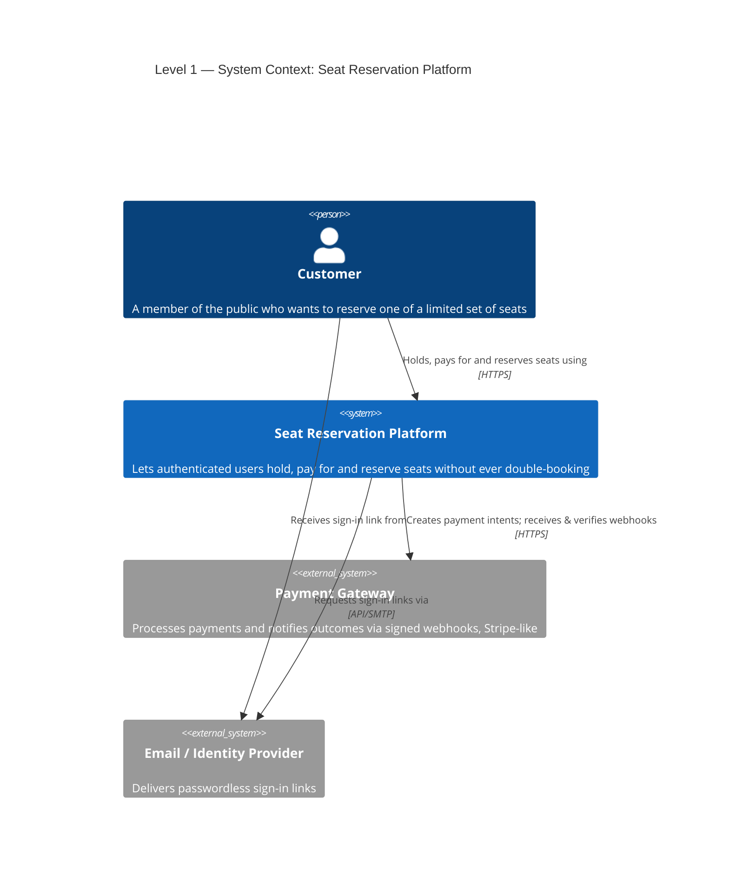
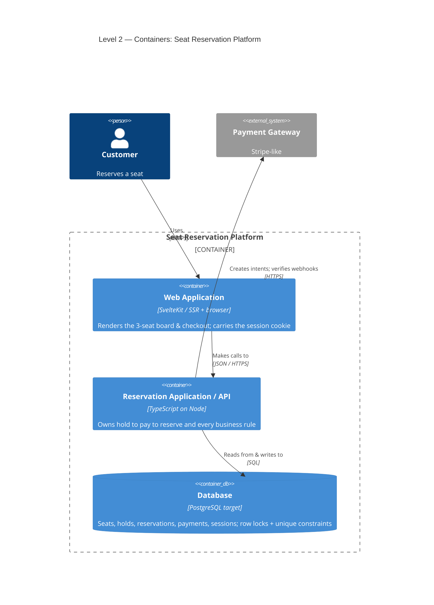
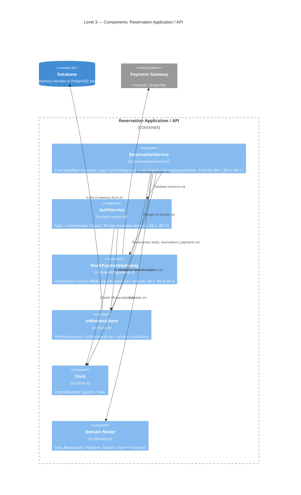
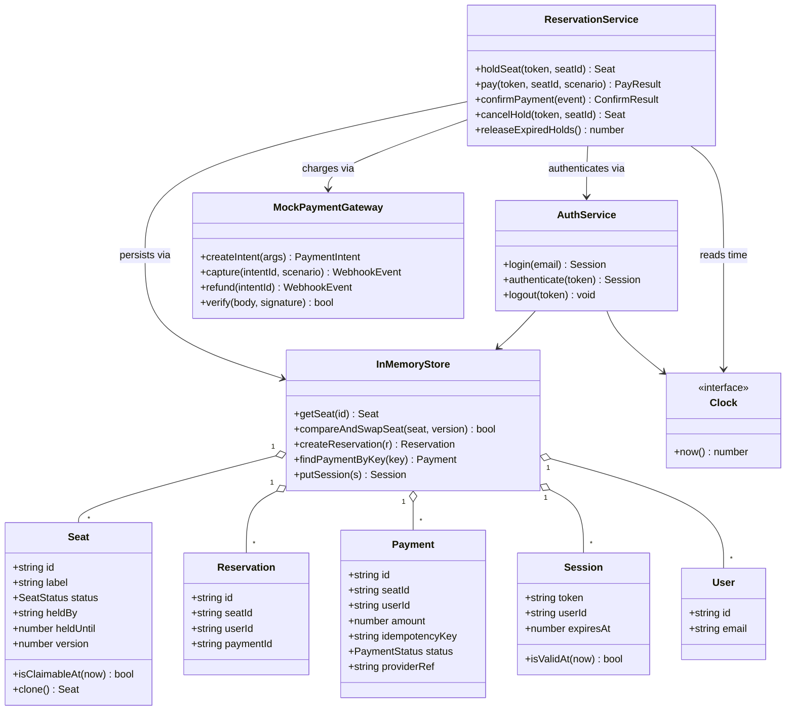
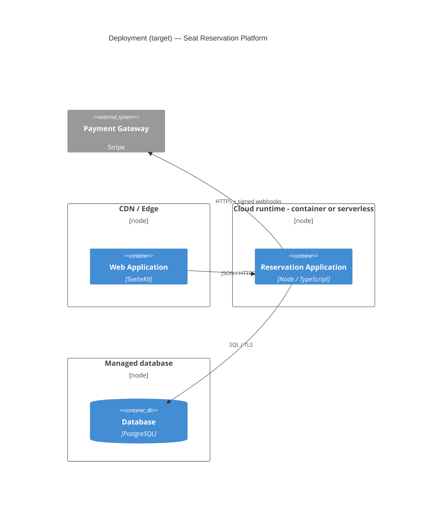

# C4 Model — Public Seat Reservation Platform

A structured architecture description using the [C4 model](https://c4model.info/) (Simon Brown).
C4 describes software as a hierarchy of abstractions you can "zoom" through — like Google Maps for
code — and is **notation-independent**: the *abstractions* matter, the boxes-and-lines style is
secondary.

| Level | Abstraction | Question it answers | Audience |
|---|---|---|---|
| 1 · **System Context** | Software System + People + external systems | How does this system fit into the world? | Everyone |
| 2 · **Container** | Independently deployable/runnable apps & data stores | What are the high-level technical building blocks? | Architects, devs, ops |
| 3 · **Component** | Groupings of related functionality inside one container | What's inside a container and how does it collaborate? | Architects, devs |
| 4 · **Code** | Classes/types implementing a component | How is a component implemented? (usually omitted) | Devs |

> **Container ≠ Docker container.** In C4 a *container* is "something that needs to be running for the
> system to work" — a web app, an API, a database, etc.

### Scope note — this repo is a focused harness

This codebase deliberately implements only the **core business logic** in-memory (no UI, no real DB,
no deployment — see [`ASSESSMENT_ANALYSIS.md`](./ASSESSMENT_ANALYSIS.md)). To keep the C4 honest:

- **Levels 1–2 (Context, Container)** describe the **target production system** — what it becomes when
  deployed — because that is the useful "big picture".
- **Levels 3–4 (Component, Code)** map **1:1 to what actually exists** in `src/`.

**Legend:** ✅ implemented in this repo · 🟡 implemented as a mock / in-memory stand-in · ⬜ target only (not built).

---

## Level 1 — System Context

| Element | Type | Status | Responsibility |
|---|---|---|---|
| Customer | Person | — | Authenticates, selects a seat, pays, receives a reservation |
| Seat Reservation Platform | System (in scope) | — | The workflow + all business rules (no oversell, money⇄inventory consistency) |
| Payment Gateway | External system | 🟡 mocked | Charges the customer; sends signed webhooks (`MockPaymentGateway`) |
| Email / Identity Provider | External system | ⬜ target | Passwordless sign-in (harness uses a trivial in-process login) |

---

## Level 2 — Container

| Container | Tech (target) | Status | Responsibility |
|---|---|---|---|
| Web Application | SvelteKit (SSR + browser) | ⬜ target | Seat board, checkout UI, holds the session cookie |
| **Reservation Application (API)** | TypeScript / Node | ✅ this repo (`src/`) | The whole business workflow — **the focus of this submission** |
| Database | PostgreSQL | 🟡 `InMemoryStore` | Durable state + concurrency guarantees (CAS / unique constraints) |
| Payment Gateway | Stripe-like (external) | 🟡 `MockPaymentGateway` | Payment intents + signed webhooks + refunds |

> **In the harness, Web + API + DB collapse into a single Node process.** The Application container is
> real (`src/`); the Database is an in-memory store that *models* the DB's concurrency semantics
> (`compareAndSwapSeat` ↔ `UPDATE … WHERE version = ?`; unique reservation ↔ `UNIQUE(seat_id)`); the
> UI is out of scope. The business rules live in the API container regardless of UI or DB choice.

---

## Level 3 — Component (inside the Reservation Application)

This is where the diagram maps exactly to the code.

| Component | Source | Status | Responsibility |
|---|---|---|---|
| **ReservationService** | `src/reservation-service.ts` | ✅ | The core. Atomic holds, hold-before-charge, idempotent confirmation, refund compensation, lazy expiry. |
| AuthService | `src/auth-service.ts` | ✅ | Login + `authenticate` (90-day expiry) + revocable sessions. |
| MockPaymentGateway | `src/payment-gateway.ts` | 🟡 | Stripe-shaped: idempotent intents, signed/verified webhooks, refunds. |
| InMemoryStore | `src/store.ts` | 🟡 | Persistence port with versioned compare-and-set + unique constraints. |
| Clock | `src/clock.ts` | ✅ | `now()` as an injected dependency → deterministic time-based rules. |
| Domain Model | `src/domain.ts` | ✅ | Entities + invariants (`Seat.isClaimableAt`, status unions). |

> **Design note (ports & adapters):** `InMemoryStore` and `MockPaymentGateway` are *adapters* behind
> implicit ports. Swapping in a Postgres repository or a real Stripe client is a Level-2/3 change that
> leaves `ReservationService` — where the business rules live — untouched.

---

## Level 4 — Code

C4 normally omits this level; the codebase is small enough that one class diagram is genuinely
useful. Maps to `src/domain.ts` (entities) and the service/adapter classes.

---

## Supplementary — Dynamic view

C4's **Dynamic** diagrams show how elements collaborate for a specific scenario. Those are already
provided, per-scenario, in **[`Sequence-Diagrams.md`](./Sequence-Diagrams.md)** — login, atomic hold,
the concurrency race, pay/confirm, paid-but-expired refund, declined payment, and duplicate webhook.
Treat that file as the Dynamic perspective of this C4 model.

## Supplementary — Deployment view

| Environment | Topology | Status |
|---|---|---|
| **Harness (this repo)** | A single `node` process: `node --test` / `node demo.ts`. No network; DB & gateway in-process. | ✅ |
| **Target production** | Web on CDN/edge · API on container/serverless · managed PostgreSQL · external Payment Gateway. Scale concurrency control from in-process CAS to DB row locks / `SELECT … FOR UPDATE`. | ⬜ |

---

## C4 element → source map

| C4 element | Level | Source |
|---|---|---|
| Seat Reservation Platform | 1 System | the whole repo |
| Reservation Application (API) | 2 Container | `src/` |
| Database | 2 Container | `src/store.ts` (in-memory) → PostgreSQL (target) |
| ReservationService · AuthService · MockPaymentGateway · InMemoryStore · Clock · Domain | 3 Components | `src/reservation-service.ts`, `src/auth-service.ts`, `src/payment-gateway.ts`, `src/store.ts`, `src/clock.ts`, `src/domain.ts` |
| Entities & service classes | 4 Code | `src/domain.ts` + service files |
| Scenario collaborations | Dynamic | [`Sequence-Diagrams.md`](./Sequence-Diagrams.md) |
| Business rules referenced (BR-*) | — | [`BA-Requirements.md`](./BA-Requirements.md) |
