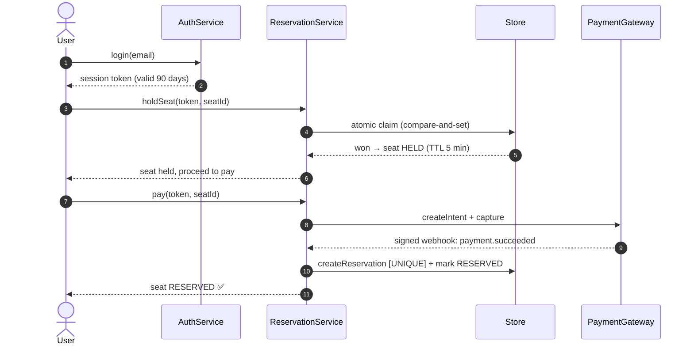
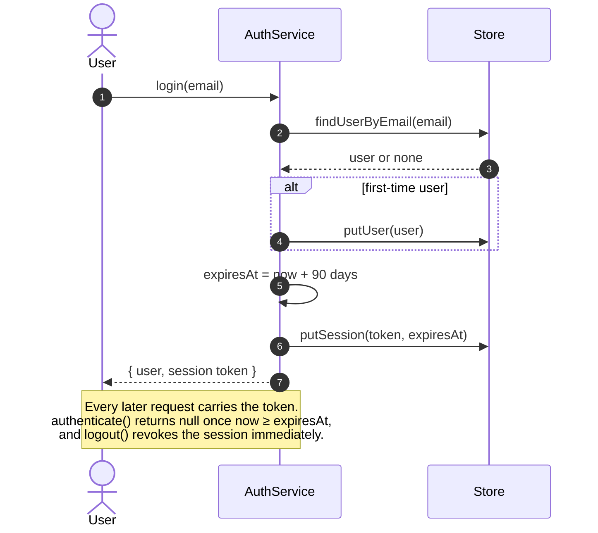
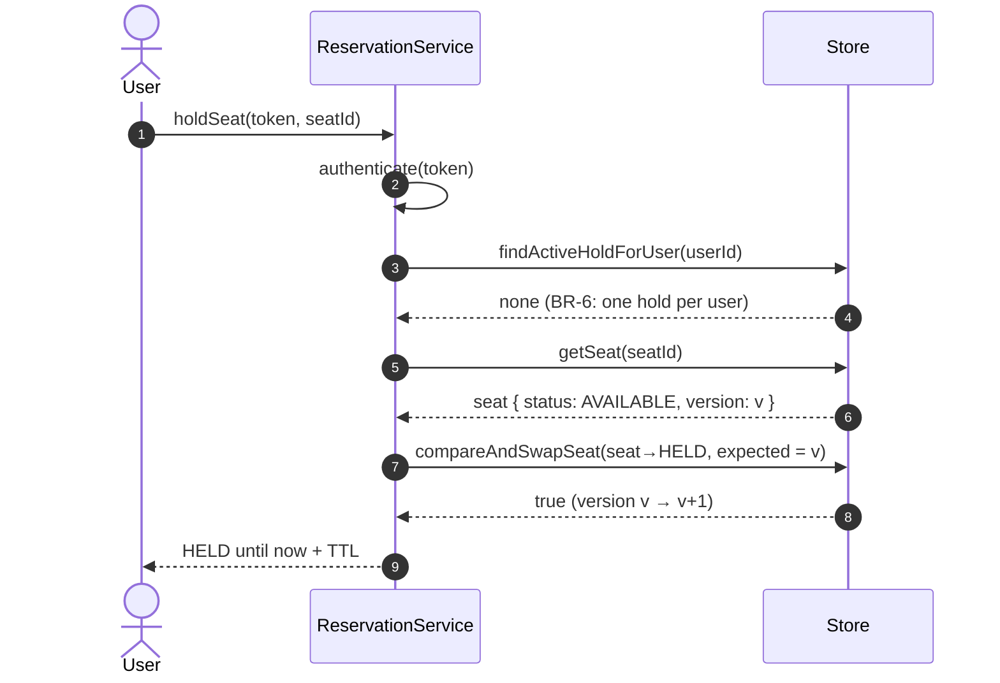
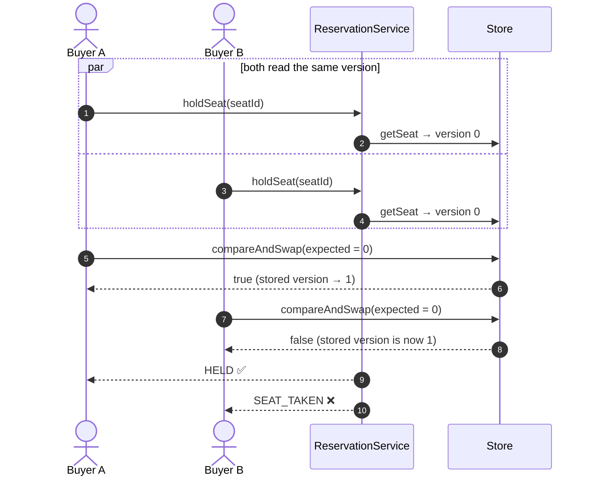
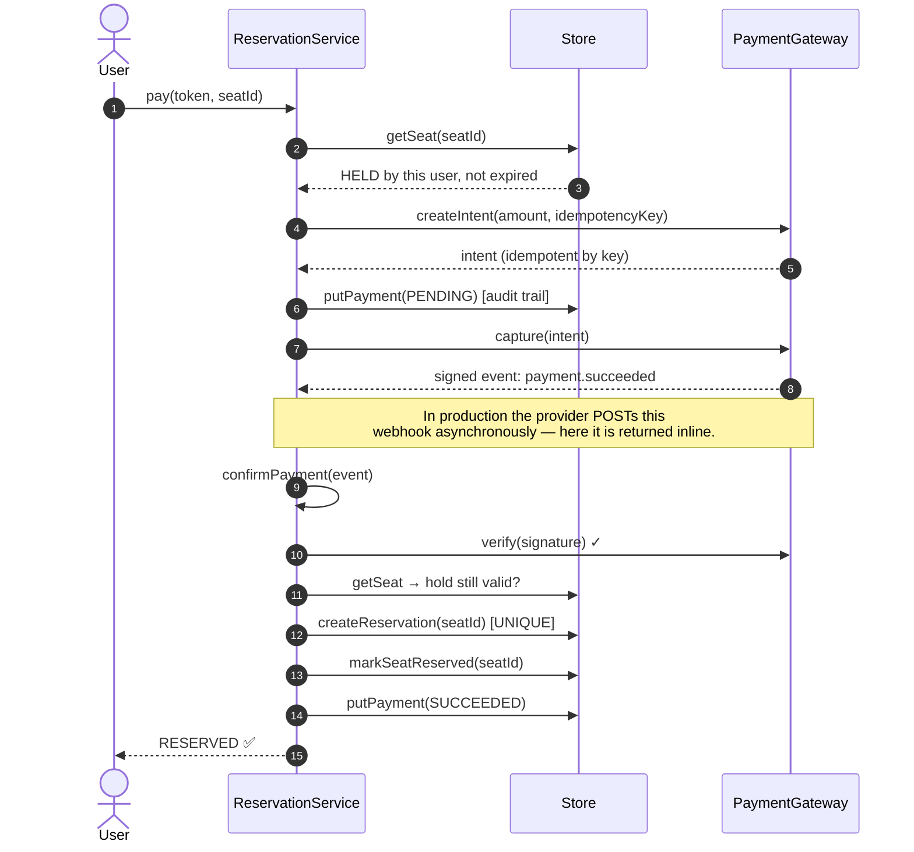
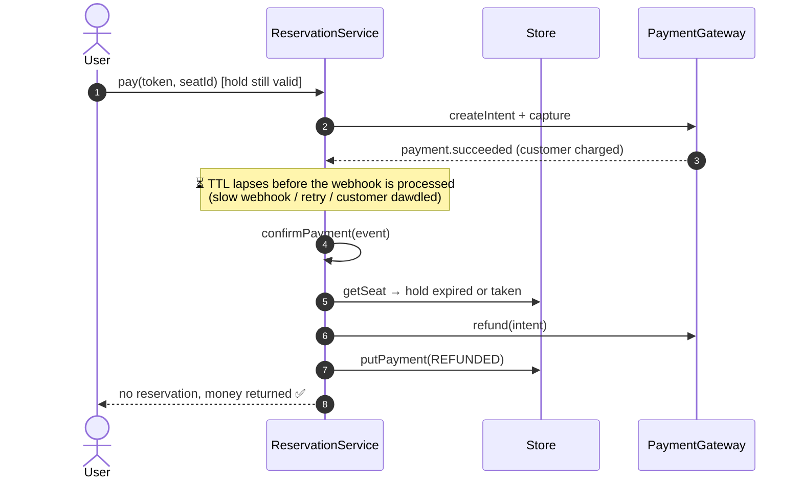
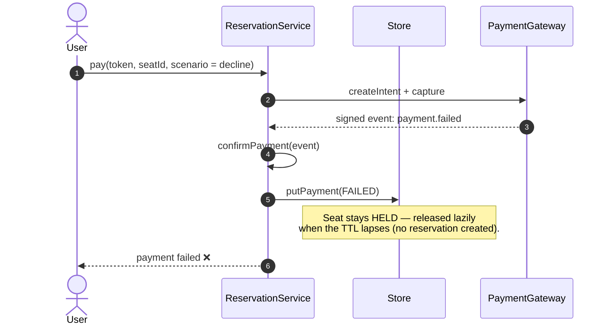
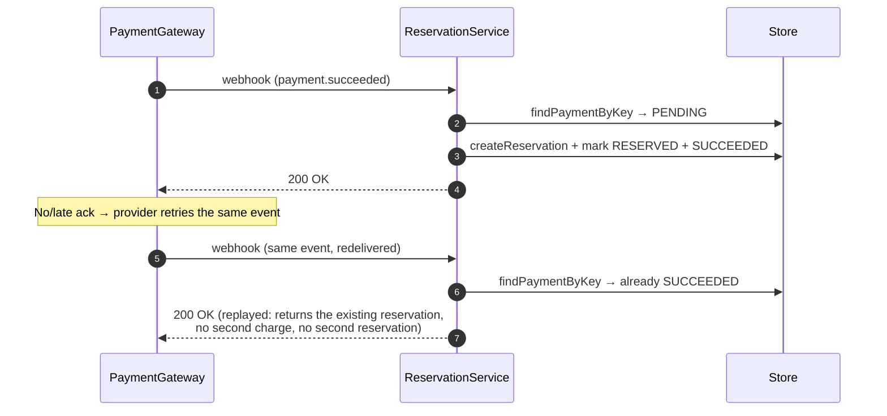
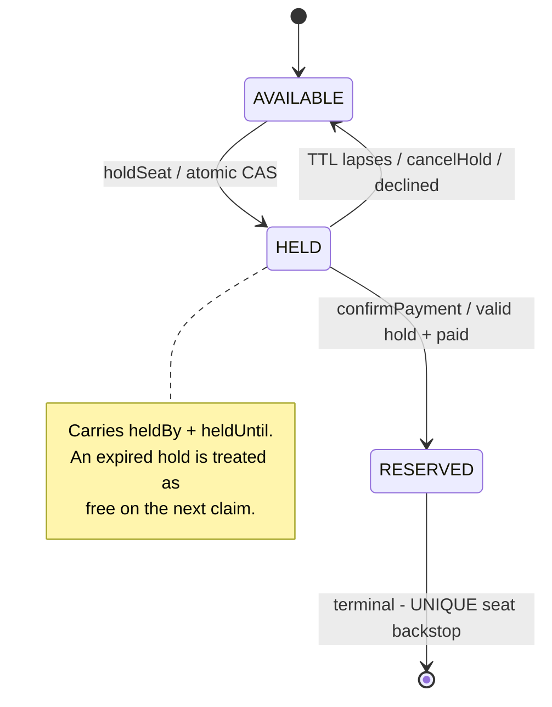

# Sequence Diagrams — Public Seat Reservation Platform

Interaction diagrams for the core workflow. Rendered with [Mermaid](https://mermaid.js.org) (shows
inline on GitHub and most Markdown viewers). Participants map 1:1 to the code:

| Diagram participant | Code |
|---|---|
| **User** | the public buyer (browser/client) |
| **AuthService** | `src/auth-service.ts` |
| **ReservationService** | `src/reservation-service.ts` (the core) |
| **Store (DB)** | `src/store.ts` — in-memory, but models DB semantics (CAS, unique constraints) |
| **PaymentGateway** | `src/payment-gateway.ts` (mock, Stripe-shaped) |

---

## 0. End-to-end happy path (overview)

---

## 1. Login & 90-day session

> **Business rules:** BR-2 (auth required), BR-10 (90-day expiry), BR-11 (revocable, server-side).

---

## 2. Select a seat — atomic hold (happy path)

> **Business rules:** BR-3 (temporary hold + TTL), BR-6 (one hold per user). Re-selecting a seat you
> already hold is idempotent (returns the existing hold).

---

## 3. The hard part — two buyers race for the same seat

> **Business rule:** BR-1 (no double-booking). The compare-and-set is the in-memory equivalent of
> `UPDATE seats SET ... WHERE id = ? AND version = ?` (or `SELECT ... FOR UPDATE`).
> **Verified by:** test *"two buyers race for one seat → exactly one wins"*, with the
> intentionally-broken `holdSeatNaive` proving the bug the CAS prevents.

---

## 4. Payment & reservation (happy path)

> **Business rules:** BR-5 (reserve only on payment), BR-7 (hold-before-charge), BR-9 (verify webhook).
> The seat is HELD **before** charging, so at most one buyer can ever pay for a given seat.

---

## 5. Paid, but the hold expired first → automatic refund (compensation)

> **Business rule:** BR-7 (never keep money without a seat). This is the single most important
> reliability path — *money and inventory must never disagree*.
> **Verified by:** test *"paid but hold already expired → refund, no reservation, seat free"*.

---

## 6. Declined payment

> **Business rule:** BR-4 (unpaid hold auto-releases at TTL).

---

## 7. Duplicate / retried webhook → idempotent

> **Business rule:** BR-8 (process payment confirmation exactly once). A `UNIQUE(seat_id)`
> reservation is the backstop even under concurrent redelivery.
> **Verified by:** test *"duplicate webhook is idempotent: one reservation, charged once"*.

---

## 8. Seat lifecycle — state model

> **Business rules:** BR-1, BR-3, BR-4, BR-5. See also `Seat.isClaimableAt(now)` in `src/domain.ts`.
